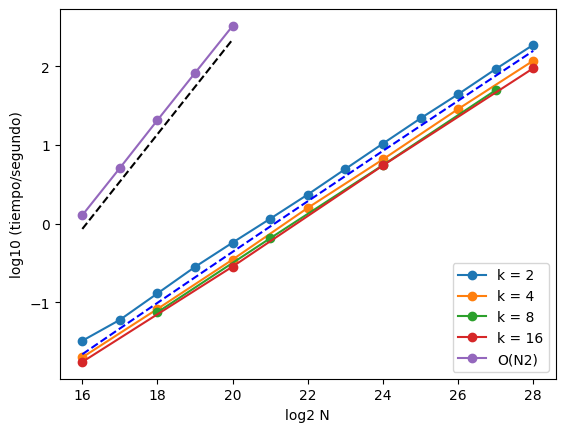

# Cache memory and RAM

This work is the result of an [assignment](Assignment.md) of an Advanced algorthms class during my master degree in computer science.

## Software Motivation

A permutation $\pi$ of $\{1, \dots, N\}$ is a reordering of the values $\{1, 2, \ldots, N\}$ in which each value appears exactly once.  The inverse of an element is defined as follows:  
$\pi^{-1}(i)$ is the inverse permutation of $i$ and is the value $j$ such that $\pi(j) = i$.

The goal of this work is to compute the inverse of a permutation by applying a sorting-based approach to pairs of the form
 $(\pi(i), i)$, where $\pi(i)$ is used as the key (reference column). After sorting these pairs by their first component, the resulting array has the form
 $(i, \pi^{-1}(i))$, thus explicitly encoding the inverse permutation.
It is worth noting that, when the input is a true permutation of $\{0, \ldots, N-1\}$, the inverse can be computed directly in linear time $\mathcal{O}(N)$ using the following approach:

```
for (int i = 0; i < n; ++i) {
    inv[p[i]-1] = i+1;
}
```

However, the purpose of this work is to explore **more general methods** based on sorting and index tracking. These techniques extend naturally to settings where direct indexing is not possible, such as when dealing with non-contiguous labels, large or arbitrary identifiers, or data distributed across multiple sorted subarrays. As such, the sorting-based approach provides a more flexible and broadly applicable framework than the specialized linear-time solution.
The results of the implementation and execution of this program are analyzed in the following sections.

The program implemented for this purpose is essentially a recursive `mergesort` with configurable arity. The arity is handled by recursively dividing the array into $k$ sorted subarrays and then merging them into a single sorted array. The main routine is called `mergeKsort` and is given by:

```cpp
void mergeKSort(int *array1, int* array2, int l, int r, int k) {
    int m;
    if(l < r) {
        int step = (r-l+1)/k;
        // MergeKsort on the k division of the array
        for (int i=0; i<k; i++) 
            mergeKSort(array1, array2, l+step*i, l+step*(i+1)-1, k);
        // Array merging
        mergeKArrays(array1, array2, l, r, k);
    }
}
```

Note that at the end of this routine the function `mergeKArrays` is used, which produces a sorted merge from $k$ sorted arrays using a heap-based data structure. The construction of the heap (of size $k$) and the extraction of the minimum at each iteration follow the same principles discussed in class.
As written, the mergeKsort program can process arrays of size $k^l$ (with arity $k$), where $l$ is a positive integer. That is, if the arity is $8 \equiv 2^3$, then arrays of length $2^{3l}$ (with $l = 1, 2, 3, \ldots$) can be processed.

The main routine (`main`) begins by generating two integer arrays iarr and piarr, both ordered from $1$ to $N$ (with $N = 2^l$). A random permutation is then generated over piarr, after which both piarr and iarr are sorted simultaneously using piarr as the reference array. After sorting, the inverse permutation $\pi^{-1}(i)$ is obtained and stored in iarr.

```cpp
int main()
{
    int power = 24; npr = 16;
    int k = 2, n = pow(2, power);
    int* ptr; int* piarr; int* iarr; int *piaux;

    piarr = (int*)malloc(n * sizeof(int));
    iarr  = (int*)malloc(n * sizeof(int));

    int ncheck = (n < 1600*10) ? min(1600, n) : n/10;
    piaux = (int*)malloc(ncheck * sizeof(int));

    cout << "log2(N) = " << power << "  k = " << k << endl;
    cout << "Size of integers in bytes = " << sizeof(int) << endl;
    cout << "Size of an array in MB = " << n*sizeof(int)/1E6 << endl;

    if (n < 16) npr = n;

    for(int i = 0; i < n; i++) {
        piarr[i] = i + 1;
        iarr[i]  = i + 1;
    }

    // generate a permutation of piarr
    permutation(piarr, n);

    for (int i = 0; i < ncheck; i++) piaux[i] = piarr[i];

    cout << "Arrays before sorting: " << endl;
    printArray(piarr, npr);
    printArray(iarr, npr);

    auto start = high_resolution_clock::now();
    mergeKSort(piarr, iarr, 0, n-1, k);
    auto stop = high_resolution_clock::now();

    auto duration = duration_cast<milliseconds>(stop - start);
    cout << "mergeKsort execution time = " << duration.count() << endl;

    cout << "Arrays after sorting: " << endl;
    printArray(piarr, npr);
    printArray(iarr, npr);

    bool checkbool = true;
    for (int i = 0; i < ncheck; i++) {
        checkbool = checkbool && (iarr[piaux[i]-1] == (i+1));
    }

    if (checkbool) {
        cout << "The inverse of the permutation is correct until n = "
             << ncheck << endl;
    }
}
```

A closer inspection of the main routine shows that the correctness of the inverse permutation is tested using the auxiliary array piaux and the boolean variable checkbool. The final loop verifies that
$\pi^{-1}(\pi(i)) = i$.

To conclude this section, the analysis presented here is intentionally brief. For a more detailed examination of the code, the reader is referred to [Readme](Readme.md) and the attached C++ source files. The main routines are contained in `InversePerm.cpp`, while the heap implementation is located in `heap.cpp` and `heap.hpp`.

## Results

In this section, we compute the execution times of the `mergeKsort` routine on a Lenovo ThinkPad P16v Gen 2, equipped with 16 GB of RAM and a Intel® Core™ Ultra 7 155H × 22.

For comparison, we also performed trial runs using a naive algorithm with $\mathcal{O}(N^2)$ execution time.
The array sizes were $N = 2^{16}, 2^{17}, \ldots, 2^{28}$ and the arities used were $k = 2, 4, 8,$ and $16$.
Note that we reached up to $N = 2^{28}$ because for larger values the program saturates the available RAM and is terminated by the operating system.

### Mean Execution Times (seconds)
| $\log_2 N$ | k = 2 | k = 4 | k = 8 | k = 16 | Naive $\mathcal{O}(N^2)$ |
|-----------:|------:|------:|------:|-------:|-------------------------:|
| 16 | 0.03 ± 0.00 | 0.02 ± 0.00 | ⋯ | 0.02 ± 0.00 | 1.28 ± 0.01 |
| 17 | 0.06 ± 0.00 | ⋯ | ⋯ | ⋯ | 5.10 ± 0.03 |
| 18 | 0.13 ± 0.00 | 0.08 ± 0.00 | 0.08 ± 0.00 | ⋯ | 20.72 ± 0.19 |
| 19 | 0.28 ± 0.00 | ⋯ | ⋯ | ⋯ | 82.37 ± 0.28 |
| 20 | 0.57 ± 0.01 | 0.35 ± 0.01 | ⋯ | 0.29 ± 0.01 | 325.84 ± 1.07 |
| 21 | 1.16 ± 0.02 | ⋯ | 0.65 ± 0.01 | ⋯ | ⋯ |
| 22 | 2.35 ± 0.04 | 1.59 ± 0.03 | ⋯ | ⋯ | ⋯ |
| 23 | 4.95 ± 0.08 | ⋯ | ⋯ | ⋯ | ⋯ |
| 24 | 10.42 ± 0.23 | 6.56 ± 0.06 | 5.55 ± 0.11 | 5.49 ± 0.12 | ⋯ |
| 25 | 21.79 ± 0.25 | ⋯ | ⋯ | ⋯ | ⋯ |
| 26 | 44.09 ± 0.39 | 28.60 ± 0.49 | ⋯ | ⋯ | ⋯ |
| 27 | 92.22 ± 0.33 | ⋯ | 49.67 ± 0.44 | ⋯ | ⋯ |
| 28 | 187.22 ± 0.74 | 117.77 ± 0.69 | ⋯ | 94.43 ± 0.45 | ⋯ |

The Table  shows the mean execution times and standard deviations computed from thirteen iterations.



The Figure presents a log–log plot of execution time versus array size. The dashed curves correspond to $N \log N$ and $N^2$ fits. 

Note: The results shown in the Figure and Table were generated using the python code `results.py`.


## Time Complexity Analysis

The execution times of the `mergeKsort` algorithm are $\mathcal{O}(N \log N)$, independently of the arity. The execution proceeds through $\mathcal{O}(\log_k N)$ levels, and at each level a cost of $\mathcal{O}(N \log k)$ is incurred.

The heap used in the mergeKarrays routine requires $\mathcal{O}(log k)$ time for each insertion and $\mathcal{O}(1)$ time for
each minimum extraction. Therefore, the total cost of merging $k$ arrays of length n is $\mathcal{O}(k\, n + k\, n \, log k),$ which is equivalent to $\mathcal{O}(k \, n \, log k)$.
At level $l$ there are $k^l$ subarrays of size $n_l = N / k^l$, which are merged into $k^{l-1}$ sets of $k$ arrays. Thus, the time required at each level is therefore

$$\mathcal{O}(k^{l-1} (k \, n_l \log k)) = \mathcal{O}(N \log k).$$

Multiplying by the number of levels, the total running time is

$$\mathcal{O}((N \log k)\log_k N) = \mathcal{O}(N \log N),$$

where we used the identity $\log_k N = \log N / \log k$.
The results confirm this analysis, showing an $N \log N$ dependence regardless of arity. Higher arity generally reduces execution time, with the most significant improvement occurring between $k = 2$ and $k = 4$. Beyond $k = 4$, the gains diminish and are likely related to memory and cache behavior combined with heap performance.

